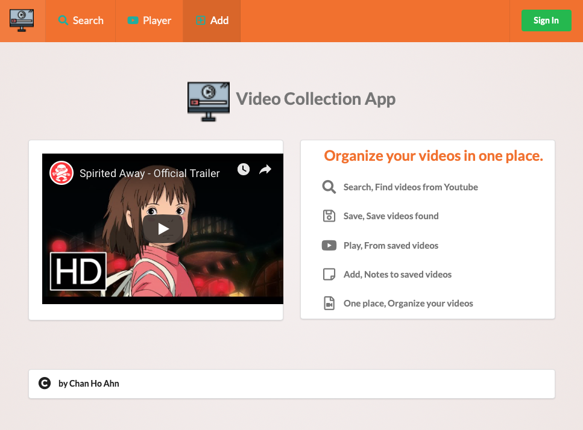
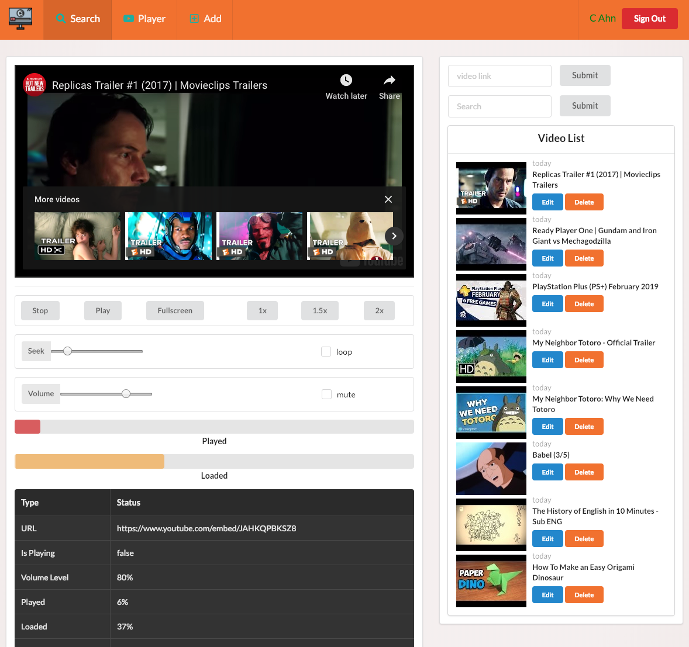
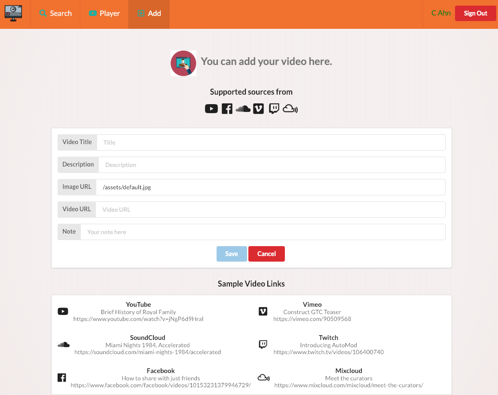

## Video Collection App

This app is to collect videos links and store them in video library.   It comes with YouTube Search page which allows users to save videos links and info by one button click.   
The built-in video play is pretty capable.  It can play many different video formats such that users are not bounded to store YouTube videos only.  "Add page" is to store non-Youtube link.  
"Player" page is pretty fancy with many built-in features including searching videos from library

  
External sources are MongoDB, Google YouTube API, Google OAuth20,

Add your own MongoDB, create dev.js 

/src/config/dev.js
```javascript
module.exports = {
  mongoURI: 'own mongodb URL'
};
````

Google API Keys, create .env at root level of project
In this repo, root level is /video-collection/client/,

Need two separate keys,
 
(1) REACT_APP_API_KEY --> key for youtube video search
(2) REACT_APP_CLIENT_ID --> client key for Google OAuth2

```javascript
/video-collection/client/.env

REACT_APP_API_KEY='your own'
REACT_APP_CLIENT_ID='your own'
```

For Heorku deployment, you need to copy your own keys to Config Vars (in Settings).
Make sure you don't surround values with quotation (""). 

```javascript
__MONGO_URI__              Your own
__REACT_APP_API_KEY__      Your own
__REACT_APP_CLIENT_ID__    Your own
```


To run : 
___npm run dev___
-------

___Login___ 'Google OAuth2'

 ___Search___  Google Youtube Search API
 
___Front End___  React, Redux, Semantic UI

___Back End___ Node, Express, MongoDB


### Screenshots 
**Home Page**


**Main Search**


**Player**


**Add**



<div>Video icon made by <a href="https://www.flaticon.com/authors/smalllikeart" title="smalllikeart">smalllikeart</a> from <a href="https://www.flaticon.com/" 			    title="Flaticon">www.flaticon.com</a> is licensed by <a href="http://creativecommons.org/licenses/by/3.0/" 			    title="Creative Commons BY 3.0" target="_blank">CC 3.0 BY</a></div>