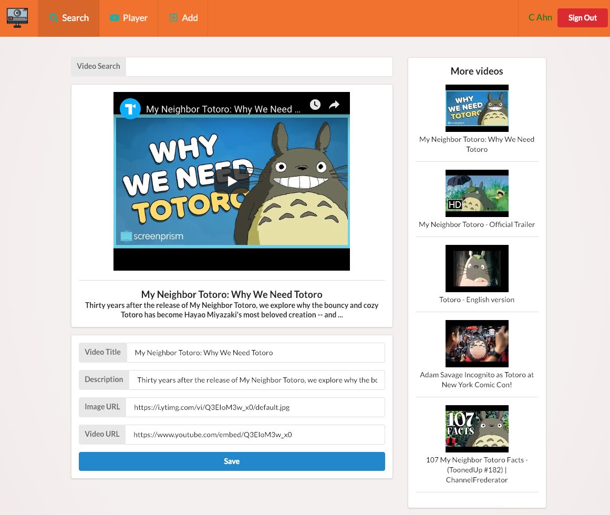

## Video Collection App

This app is to collect videos links and store them in video library.   It comes with YouTube Search page which allows users to save videos links and info by one button click.   
The built-in video play is pretty capable.  It can play many different video formats such that users are not bounded to store YouTube videos only.  "Add page" is to store non-Youtube link.  
"Player" page is pretty fancy with many built-in features including searching videos from library

  


To run it, add your own MongoDB, 
and create dev.js 

/src/config/dev.js
```javascript
module.exports = {
  mongoURI: 'own mongodb URL'
};
````

To run : 
___npm run dev___
-------

___Login___ 'Google OAuth2'

 ___Search___  Google Youtube Search API
 
___Front End___  React, Redux, Semantic UI

___Back End___ Node, Express, MongoDB


### Screenshots 
**Home Page**


**Main Search**


**Player**


**Add**


<div>Video icon made by <a href="https://www.flaticon.com/authors/smalllikeart" title="smalllikeart">smalllikeart</a> from <a href="https://www.flaticon.com/" 			    title="Flaticon">www.flaticon.com</a> is licensed by <a href="http://creativecommons.org/licenses/by/3.0/" 			    title="Creative Commons BY 3.0" target="_blank">CC 3.0 BY</a></div>